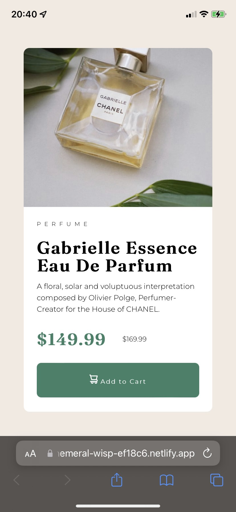

# Frontend Mentor - Product preview card component solution

This is a solution to the [Product preview card component challenge on Frontend Mentor](https://www.frontendmentor.io/challenges/product-preview-card-component-GO7UmttRfa). Frontend Mentor challenges help you improve your coding skills by building realistic projects.

This is my very first journey into the world of frontend. Don't judge too harshly.
## Table of contents

- [Overview](#overview)
  - [The challenge](#the-challenge)
  - [Screenshot](#screenshot)
  - [Links](#links)
- [My process](#my-process)
  - [Built with](#built-with)
  - [What I learned](#what-i-learned)
  - [Continued development](#continued-development)
  - [Useful resources](#useful-resources)
- [Author](#author)
## Overview

### The challenge

Users should be able to:

- View the optimal layout depending on their device's screen size
- See hover and focus states for interactive elements

### Screenshots
Desktop version:


With active button:


Mobile version:


### Links

- Solution URL: [here](https://ephemeral-wisp-ef18c6.netlify.app/)

## My process

### Built with

- HTML5
- CSS3

### What I learned

- Making CSS media queries for responsive design
```css
@media screen and (max-width: 260px) {
  .full_title {
    font-size: 10vw;
  }
  .description {
    font-size: 1vh;
  }
  .discount_price {
    font-size: 10vw;
  }
  .old_price {
    font-size: 5vw;
  }
}
```
- Filling the entire content box with an image using object-fit property:
```css
.parfum_pic {
  width: 100%;
  height: 100%;
  object-fit: cover;
  border-radius: 10px 0 0 10px;
}
```

### Continued development

In the future I'm going to try out for some projects using JavaScript. Also, I think I should make something that will require more active use of CSS Flexbox and familiarize myself with CSS Grid.

### Useful resources

- [Netlify](https://www.netlify.com/) - Useful service to fastly build a backendless site.
- [MDN Web Docs](https://developer.mozilla.org/) - Excellent reference for web development.
## Author

- Frontend Mentor - [@serjunya](https://www.frontendmentor.io/profile/serjunya)
- VK - [@golovogay](https://vk.com/golovogay)
